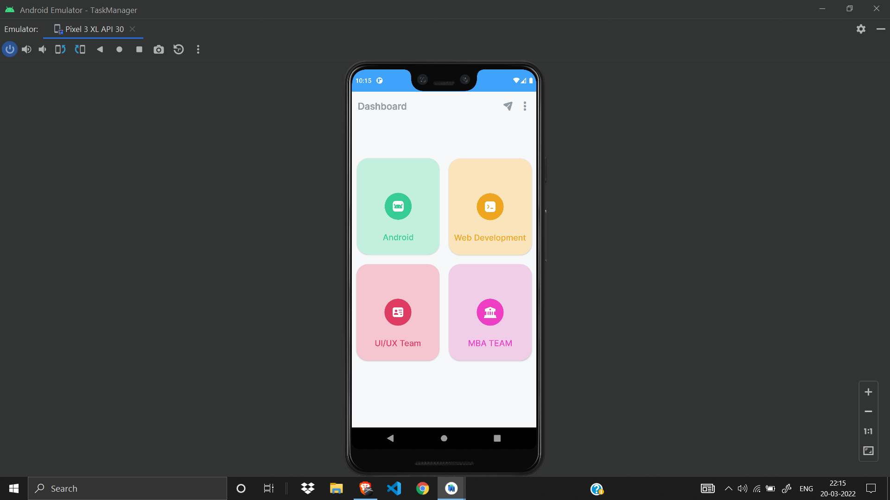
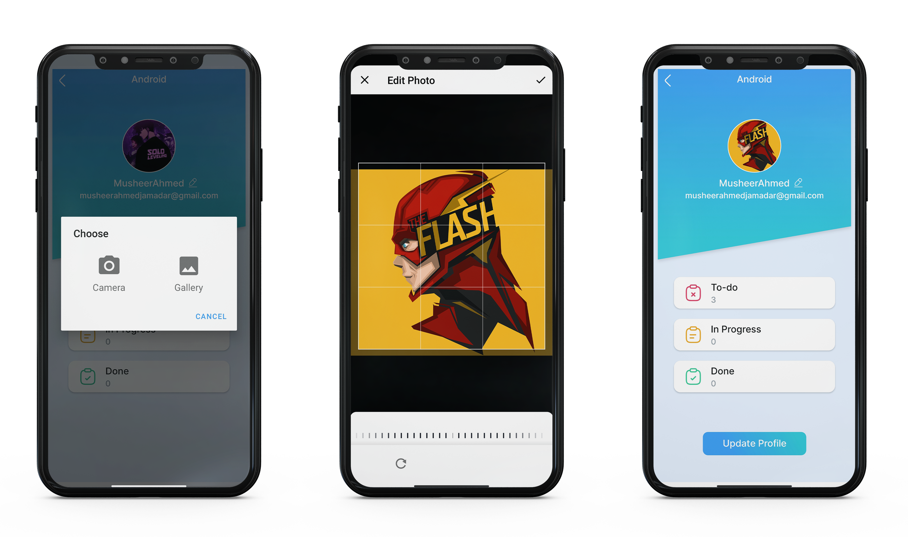

 
  

&#xa0;

  <!-- <a href="https://e_commerce_app_flutter.netlify.app">Demo</a> -->

<h1 align="center">Team Nequit App</h1>

## Status

<h4 align="center">
	🚧  Nequit App 🚀 Completed 🚧
</h4>

  <a href="#dart-about">About</a> &#xa0; | &#xa0; 
  <a href="#sparkles-features">Features</a> &#xa0; | &#xa0;
  <a href="#checkered_flag-illustrations">Illustrations</a> &#xa0; | &#xa0;
  <a href="https://github.com/MusheerJ" target="_blank">Author</a>

 

## :dart: About

This is an Activities Management Application developed using AndroidFire(Android+Firebase). This Application is specially developed for team-nequit for managing and monitoring their work and activities.
## :sparkles: Features

:heavy_check_mark: User Authentication\
:heavy_check_mark: Password Resetting\
:heavy_check_mark: Adding/Updating Attendance\
:heavy_check_mark: Polls\
:heavy_check_mark: List of Members\
:heavy_check_mark: Feedbacks\
:heavy_check_mark: Manage User Profile

## :checkered_flag: Illustrations

Here are some Illustration of App Screens

|  |  |  |
| :--------------------------------: | :---------------------------------------: | :----------------------------------: |
|            Home Screen             |            Home Screen Drawer             |            User Profile             |

|  |  |  |
| :----------------------------------: | :----------------------------: | :----------------------------: |
|        Splash Screen         |         Sign In Screen         |         Sign Up Screen         |

|  |  |  |
| :------------------------------------: | :----------------------------------------: | :-------------------------------------------: |
|         List Of Members         |         Attendance Of Members        |         Poll Results         |

|  |  |  |
| :---------------------------------: | :------------------------------------: | :---------------------------------: |
|         Poll Replies         |         Team Rules         |         News Letter        |

